# L3 Assignment. IMAGES

## 3.2.1 Install Git on your computer


```c
 a). Git Bash On my computer
````


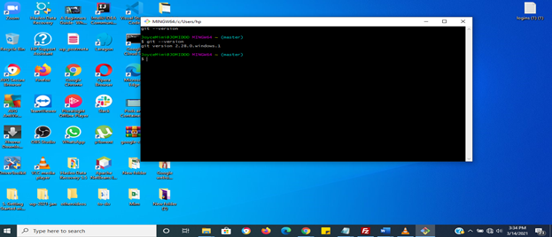

check also 
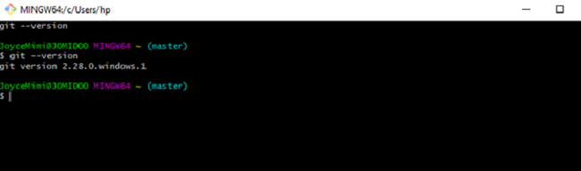


```c
b). Running Git on my windows command line (cmd)
````
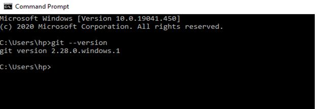


## 3.2.2 Create a Git-Hub account ( if you don't already have one ) and create a repository called "SCA-devops"

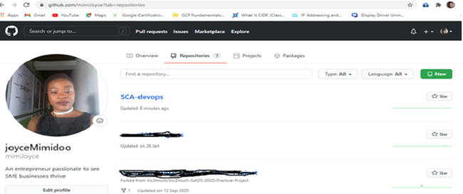

## 3.2.3 Add your first Readme file (explain in your ReadMe file that the repo is for SCA DevOps levelled membership assessment)

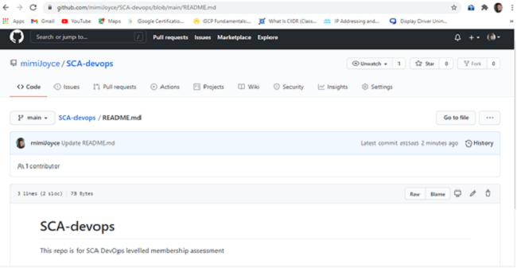

## 3.2.4  On your local system, create a directory called "repository"

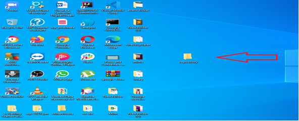

## 3.2.5  Clone the repository you created in (2) above into your local system inside the directory in (4) above.

```c
i). gitbash into repository by right clicking on the repository folder and selecting Git Bash Here

```
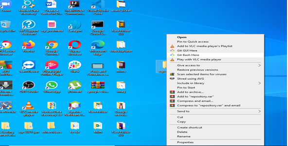

```c
ii). Git Bash opens

```
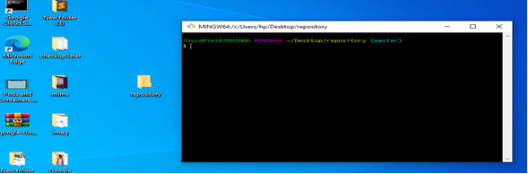

```c
iii). Open up the repository folder on your desktop, set it side by side and then clone SCA devops repository and watch what happens in your local repository folder

```
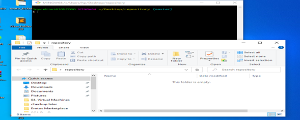

## Initialise your local folder with the command <git init> then Clone your repository with ssh to local directory and watch it show up in repository folder

```c
a). clone repository

```
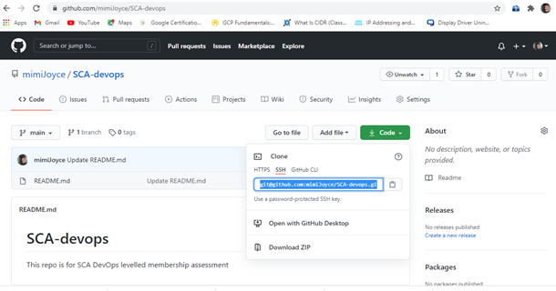

```c
b). in your Git Bash, use git clone<INSERT-CLONE-REPO-COPIED-HERE>

```
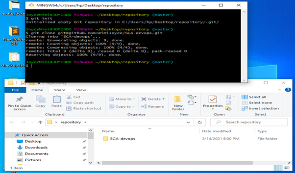

## 3.2.6 Create a new branch called "Ass-1" with this command: git branch [branch-name]

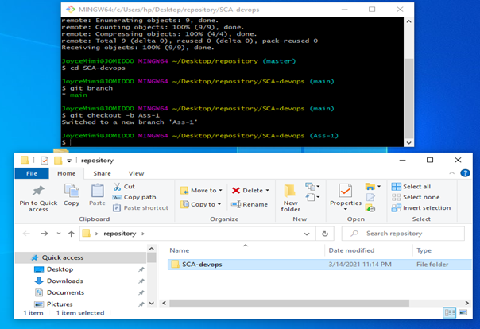

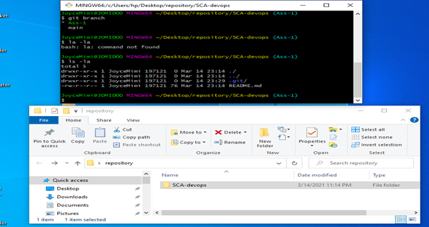

## 3.2.7     In your new branch, add the solution to your Assignment in L1

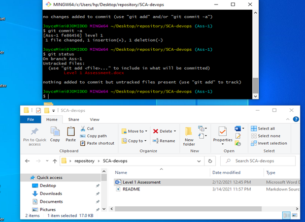

## 3.2.8 Commit your local changes and push to your upstream repository

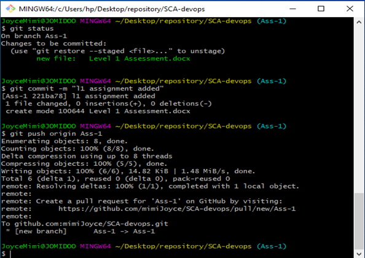

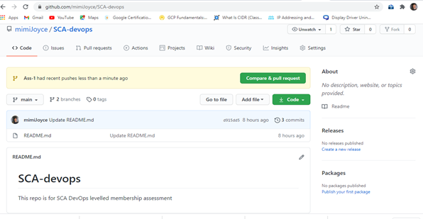

## Ass-1 git branch on remote repo
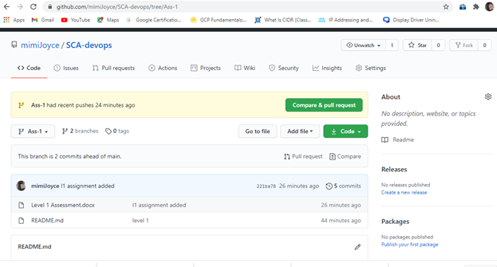

## 3.2.9  Create a Pull Request (PR) from Ass-1 branch to your Master or Main branch


```c
a). click pull request
```
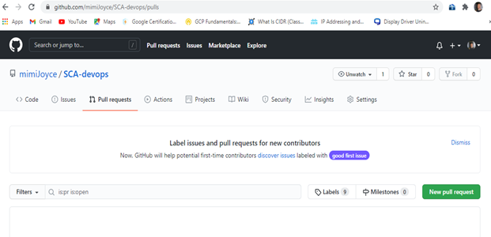

```c
b). bring changes made in Ass-1 into main branch
```
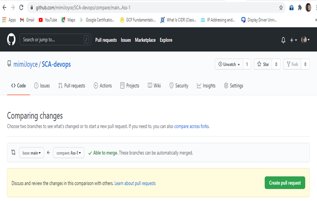

```c
c). enter title
```
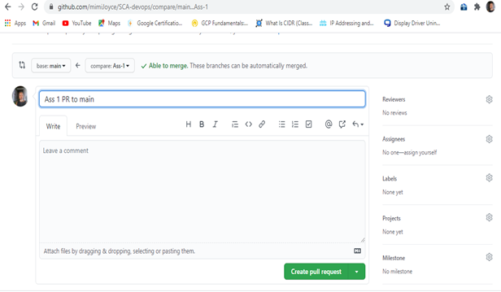

```c
d). your pull request
```
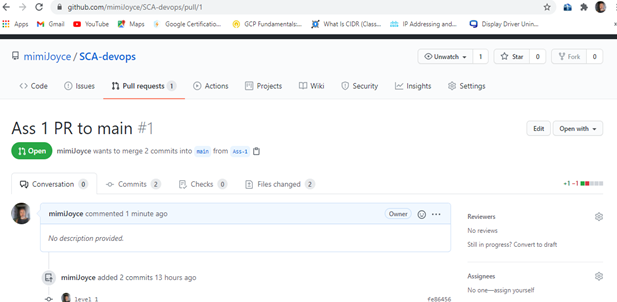

# 3.2.10  Copy the link of your PR and save it somewhere

```c
https://github.com/mimiJoyce/SCA-devops/pull/1

https://github.com/mimiJoyce/SCA-devops/pulls


```

# 3.2.11  Merge your PR to master

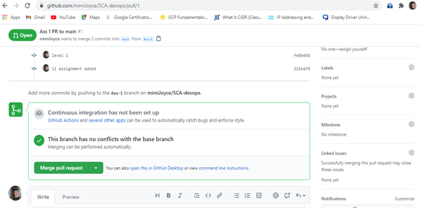

```c
b). click confirm merge

```
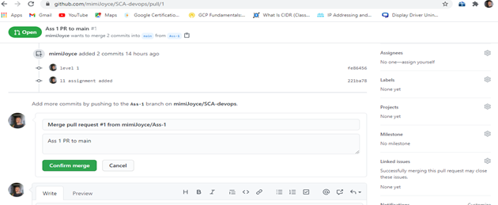

```c
c) Pull request successfully merged 

```
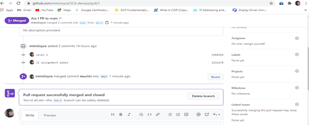

```c
d). you can delete Ass-1 branch, if you wont be needing it again.

```


# 3.2.12      On your local system (on the master branch), pull your upstream change so that your local master is same as its origin

```c
1. type this command: git fetch to all branches on remote
2. git checkout main to checkout from Ass-1 to main branch
3. git pull to bring in all the changes on repo

````

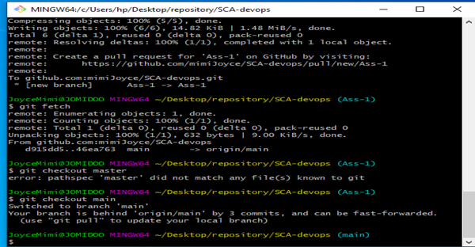

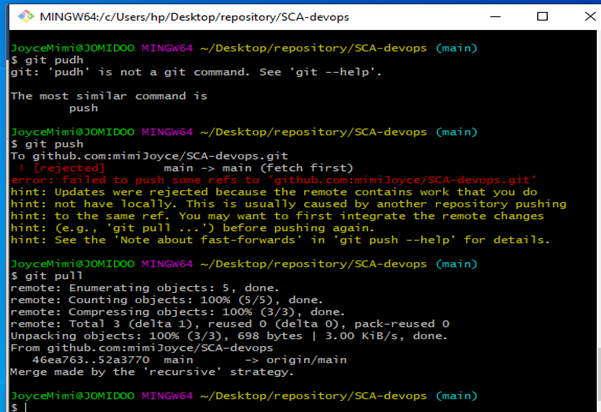

# 3.2.13 Now create a new branch called "Ass-2". from master

```c
a). use command: git branch Ass-2 to create Ass-2 branch and git branch to see your branches and git checkout Ass-2 to move into Ass-2 branch

````

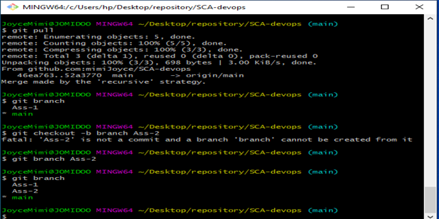

# 3.2.14 In your new branch, add the solution to your Assignment in L2

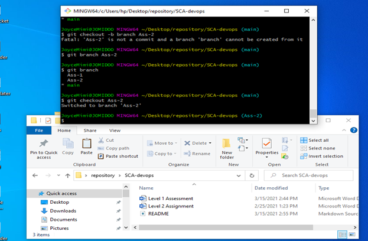

# 3.2.15  Commit your local changes and push to your upstream repository

```c
a). Commit your local changes

```
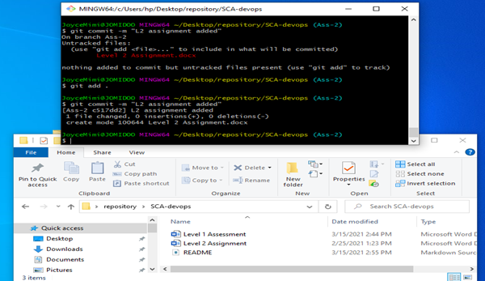

```c
b). push your Commit to your upstream repo

```
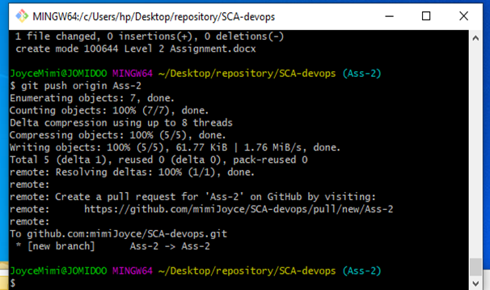

```c
c). Check your GitHub

```
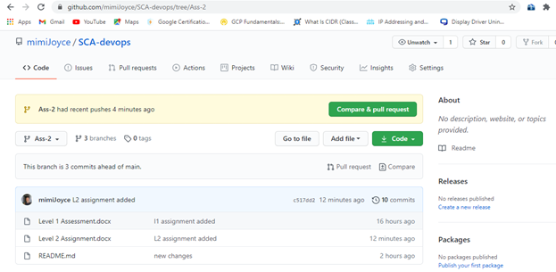

# 3.2.16  Create a Pull Request (PR) from Ass-2 branch to your Master or Main branch

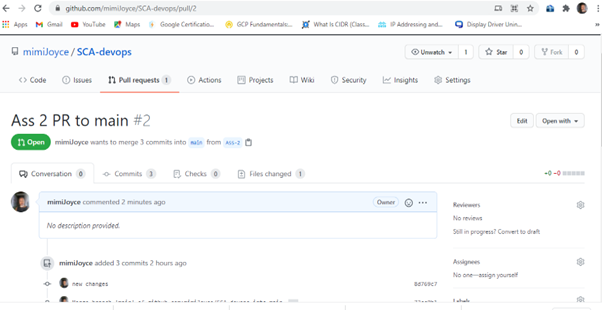

# 3.2.17  Copy the link of your PR and save it somewhere

```c
https://github.com/mimiJoyce/SCA-devops/pull/2

```

# 3.2.18 Merge your PR to master

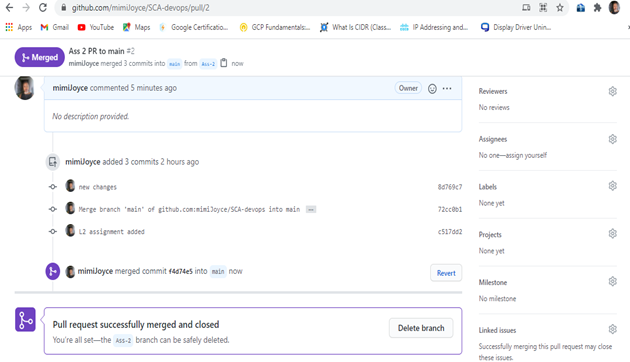

# 3.2.19  Submit your GitHub repo URL

```c
https://github.com/mimiJoyce/SCA-devops

```

# 3.2.20 Submit the links to your 2 PR created

```c
https://github.com/mimiJoyce/SCA-devops/pull/2

https://github.com/mimiJoyce/SCA-devops/pull/1

https://github.com/mimiJoyce/SCA-devops/pulls


```

compiled by: 
```c
compiled by joyceMimi

`````